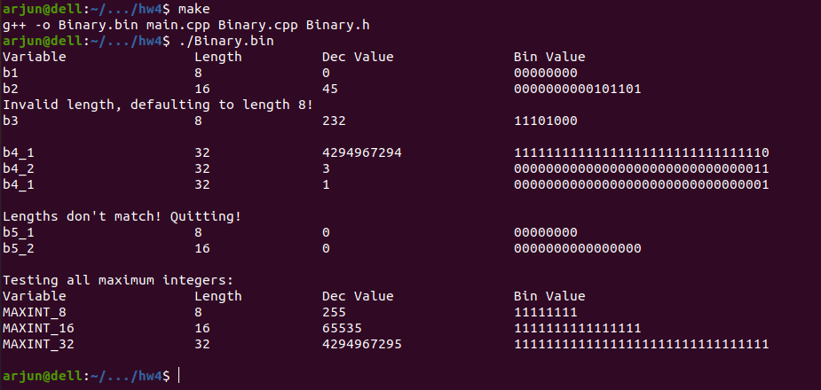

# Homework 4 (200 points, due 04/12/2024 11:59 PM)

## Submission Instructions
Push your solution files to your Github classroom repository. The quiz assignment from 04-03 should help you
get oriented with Github pushing if you're not used to it. Briefly:
1. Clone the homework repository locally 
2. Make your changes locally 
3. Commit your changes (so they are staged and ready to be pushed online). Additionally, new files need to be added before committing.
4. First pull to make sure the remote repo hasn't been changed in the meantime, and then push your changes.

You will have to compile C++ code to build executables so that you can test your programs, but **don't** submit 
these executables (or any object files that might be built). To make things easier, you can use a 
[Gitignore file](https://docs.github.com/en/get-started/getting-started-with-git/ignoring-files) and have it ignore
all files with extensions `.o` or `.bin` (to do this you would have to add lines `*.o` and `*.bin` to your `.gitignore`
file in your repo).

**The following instruction is very important to follow throughout the semester for this class, and through 
your programming career.**
Your solutions must provide **only** what is asked for, nothing less (this isn't a new idea, if your answer contains 
less than what is asked for then you lose points), but also *nothing more* - I want to stress this, you could lose 
points for saying more than what is asked for, including leading or trailing whitespaces. One reason for this is that we may 
use automated scripts to grade your solutions, and we have to tell these scripts exactly what to expect from your
solutions. This is analogous to programming in the real world where programs will generate data that are used by 
other programs that don't think like humans, they need to understand the precise form of the data, and can't 
account for even small variations such as unexcepted white-spaces.
Now, sometimes what is asked for is not clear. In this case, your problem is underspecified, so it is not clear 
what to do. In such cases, (and even in cases where the problem is correctly specified but unclear to you) 
you must ask clarifying questions. Please do this on Slack in the channel corresponding to the assignment (#hw4), 
or during office hours.

## Additional Instructions
Your code must compile. This is a programming class so you're not going to get too many points for code that 
doesn't compile even if you have some logic figured out. So if you have only understood some of the logic, make sure
you make it compile so that you can get points for it.

The expected output represents only a few specific tests for which your code should work. You need to implement the logic
specified in this document, not hardcode for the cases mentioned in the tests. The tests are commented out in the `main`
function and the `testMaxInts` function. Once you implement the class and the necessary code, uncomment the code that includes
your header and the test code. Leave these uncommented in your submission. You will want to add other tests, but make sure you 
remove them before submitting.

## Objective
The goal is to extend out functions on 4-bit binary numbers to work for larger binary numbers, and to organize them into 
an OOP-style library.

## Requirements
1. Create a `Makefile` so that 
    * running `make` in your repo creates the executable `Binary.bin`, the running of which
      has the following output (after implementing the `Binary` library, and uncommenting the code in `main.cpp`):

      
    * running `make clean` removes any binary files or object files created from compilation
2. Create a `Binary` class that implements the library - `Binary.h` will contain its definition and interface, and 
    `Binary.cpp` will contain its implementation. You're not required to have other files, but you can if you want.
3. The class data and interface are described in what follows.

### Data
The class `Binary` used to create unsigned integers is composed of the following data.
1. Integer `m_length` always stores the length of the integer. The length can either be 8, 16, or 32. This is unchangeable after initialization.
2. Dynamic array of bools `m_bits` (`std::vector` of bools) always stores the integer in binary.
3. A large enough unsigned integer `m_dec` (`unsigned long long` should work on most computers) always stores the integer in decimal.

### I/O Interface
The class will have the following interface for input and output:
1. Default constructor `Binary()` will construct an 8-bit `0`.
2. Another constructor will take 2 arguments: the first representing the length of the integer to construct, and the second
    representing its value. The length can only be 8, 16, or 32. If not, the constructor will default to length 8 and print the 
    following to the console:
    ```
    Invalid length, defaulting to length 8!
    ```
    If the second argument isn't in the range specified by the first argument, its value will wrap around to fit in range, as 
    is done for C++'s unsigned integers. See the `Unsigned integer overflow` section [here](https://www.learncpp.com/cpp-tutorial/unsigned-integers-and-why-to-avoid-them/) if this is unclear.
3. Member function `printBin()` will print the current integer in binary to `cout`.
4. Member function `printDec()` will print the current integer in decimal to `cout`.

### Operator Interface
The functions over binary integers (we'll refer to them as operators since they are performing the functionality 
that operators do) that we defined in HW2 will simply be part of the interface of the `Binary` class. 
Requirements:
1. The operators must perform the operation on the binary version of the integer (`m_bits`) and not on the decimal version (`m_dec`).
2. All operators will change **both** the binary and decimal values of the current object. So "unary" operators (`NOT`) will 
    operate on the value of `this` object. "binary" operators (`AND`, `add`, etc.) will take an object as argument and perform 
    the corresponding operator on 1. `this` object and 2. the argument, and store the result in `this`. So it suffices
    to pass the object by const reference to the operators.
3. The (binary) operators can only operate on integers that have the same length. When called on integers with mismatched lengths, 
    the operator will print the following to the console:
    ```
    Lengths don't match! Quitting!
    ```
The class will offer the following operators through its interface:
1. `bAnd`: performs binary bitwise AND on the operands.
2. `bOr`: performs binary bitwise OR on the operands.
3. `bXor`: performs binary bitwise XOR on the operands.
4. `bNot`: performs unary bitwise NOT on the operand.
5. `lShift`: performs left shift on the operands.
6. `rShift`: performs right shift on the operands.
7. `bAdd`: performs binary addition on the operands. Overflowing values will wrap around.


### Conversions
Even though the interface won't have conversion functions between binary and decimal representaiton, you will need them internally
to ensure that all objects have a consistent representation in both forms.

## Testing
Test your functions extensively. The test cases in `main` are far from sufficient. You can use the decimal to binary and binary to decimal converters from [here](https://www.rapidtables.com/convert/number/index.html) to make your test cases. You're 
essentially building a (somewhat limited) back-end for such a website in this assignment.

## Grading
Assuming your code compiles, the 200 points will be divided as follows:
1. 105 points for implementation of each of the operators, 15 for each.
2. The remaining 95 points will account for the `Makefile`, organization of your code, implementaiton of your constructors,
   ensuring that all objects have a consistent representation in binary and decimal.

## Errata
Any updates to the spec will not be reflected in your private repository. An updated version (if any) will be stored in 
`uiowa-cs-3210-spr24/hw4` and all changes will be listed in `Errata.md` in that repository.